# Architecture Overview - Front-End

## 📐 Kiến Trúc Tổng Quan (Architecture Diagram)

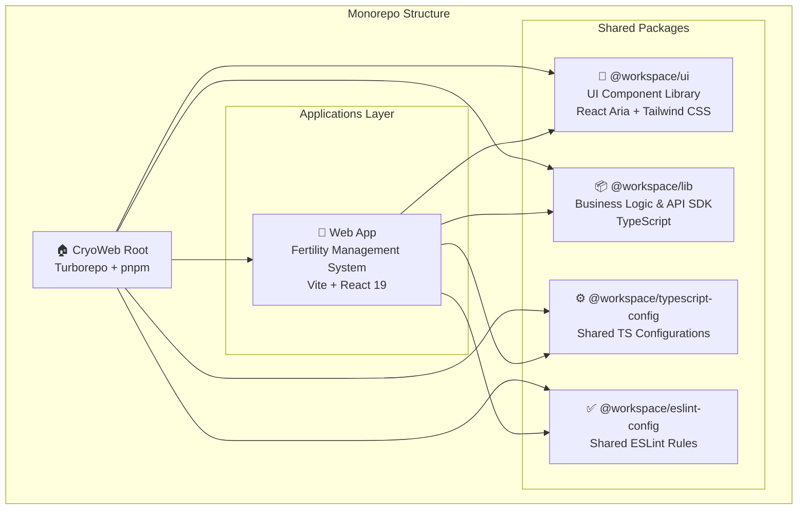

## 🏗️ Web Application Architecture (apps/web)

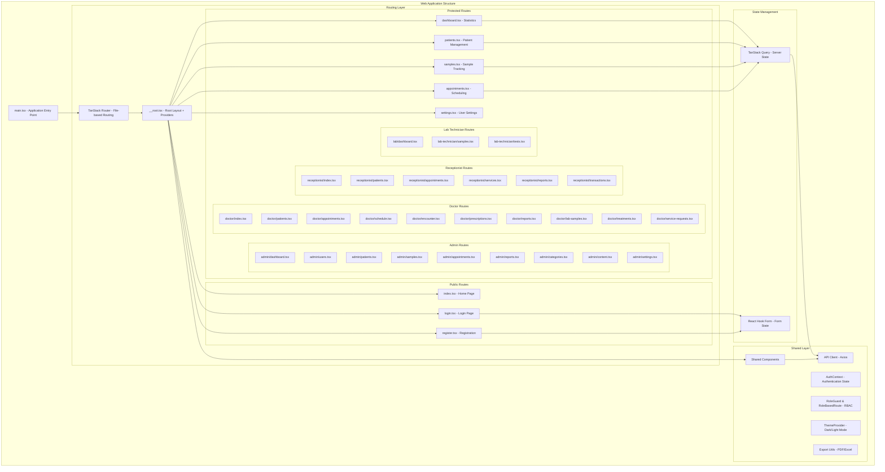

## 📦 Packages Architecture

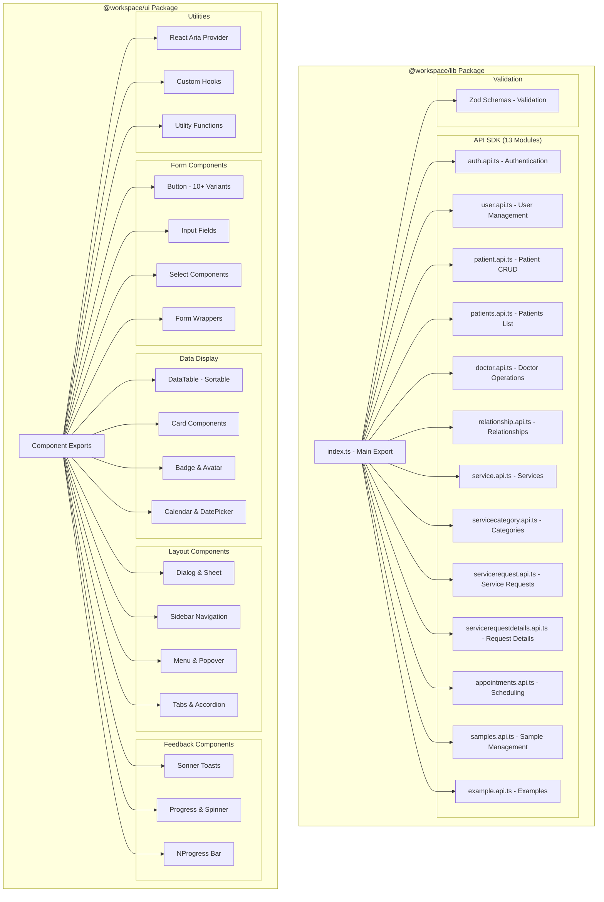

## 🔄 Data Flow Architecture

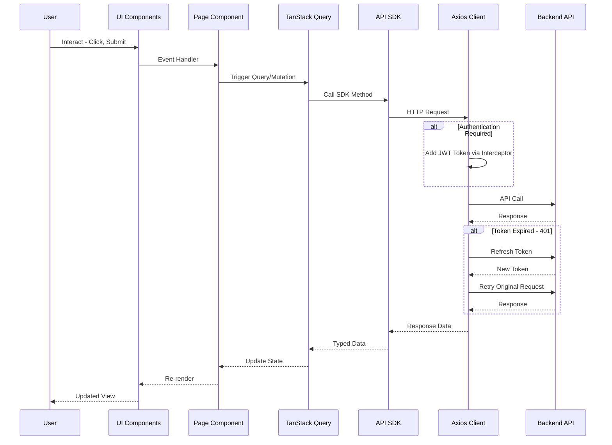

## 🎨 Component Architecture

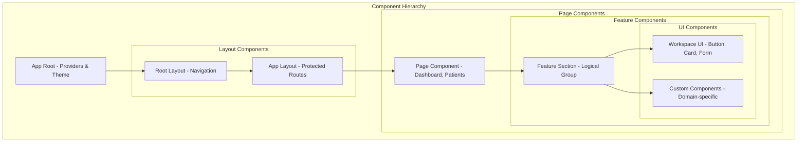

## 🛠️ Technology Stack

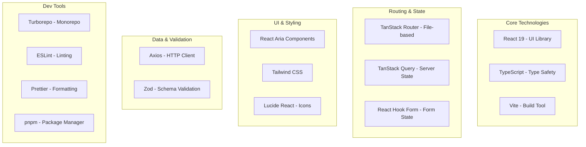

## 📂 File Structure Details

### Web App Structure (apps/web)

```
apps/web/
├── src/
│   ├── main.tsx                    # Entry point
│   ├── routeTree.gen.ts           # Generated route tree
│   │
│   ├── routes/                     # File-based routing (40+ routes)
│   │   ├── __root.tsx             # Root layout + providers
│   │   ├── index.tsx              # Home page (/)
│   │   ├── login.tsx              # Login page (/login)
│   │   ├── forgot-password.tsx    # Password recovery
│   │   ├── dashboard.tsx          # General dashboard
│   │   ├── patients.tsx           # Patient listing
│   │   ├── samples.tsx            # Sample listing
│   │   ├── appointments.tsx       # Appointment listing
│   │   ├── settings.tsx           # User settings
│   │   ├── about.tsx             # About page
│   │   ├── contact.tsx           # Contact page
│   │   ├── features.tsx          # Features page
│   │   ├── pricing.tsx           # Pricing page
│   │   ├── careers.tsx           # Careers page
│   │   ├── security.tsx          # Security page
│   │   ├── services.tsx          # Services listing
│   │   ├── services/             # Service detail pages
│   │   │   ├── index.tsx
│   │   │   ├── ivf.tsx
│   │   │   ├── iui.tsx
│   │   │   ├── egg-freezing.tsx
│   │   │   ├── embryo-freezing.tsx
│   │   │   ├── fertility-preservation.tsx
│   │   │   └── male-fertility.tsx
│   │   ├── admin/                # Admin routes
│   │   │   ├── dashboard.tsx
│   │   │   ├── users.tsx
│   │   │   ├── patients.tsx
│   │   │   ├── samples.tsx
│   │   │   ├── appointments.tsx
│   │   │   ├── reports.tsx
│   │   │   ├── categories.tsx
│   │   │   ├── content.tsx
│   │   │   └── settings.tsx
│   │   ├── doctor/               # Doctor routes
│   │   │   ├── index.tsx
│   │   │   ├── patients.tsx
│   │   │   ├── appointments.tsx
│   │   │   ├── schedule.tsx
│   │   │   ├── encounter.tsx
│   │   │   ├── prescriptions.tsx
│   │   │   ├── reports.tsx
│   │   │   ├── lab-samples.tsx
│   │   │   ├── treatments.tsx
│   │   │   └── service-requests.tsx
│   │   ├── receptionist/         # Receptionist routes
│   │   │   ├── index.tsx
│   │   │   ├── patients.tsx
│   │   │   ├── appointments.tsx
│   │   │   ├── services.tsx
│   │   │   ├── reports.tsx
│   │   │   └── transactions.tsx
│   │   ├── lab-technician/       # Lab Technician routes
│   │   │   ├── samples.tsx
│   │   │   └── tests.tsx
│   │   ├── lab/                  # Lab routes
│   │   │   └── dashboard.tsx
│   │   ├── admin.tsx             # Admin layout
│   │   ├── doctor.tsx            # Doctor layout
│   │   ├── receptionist.tsx      # Receptionist layout
│   │   ├── lab-technician.tsx    # Lab Technician layout
│   │   └── unauthorized.tsx     # Unauthorized page
│   │
│   └── shared/
│       ├── components/            # Shared components
│       │   ├── AppLayout.tsx     # App layout wrapper
│       │   ├── Providers.tsx     # Context providers (Query, Router)
│       │   ├── ProtectedRoute.tsx # Route protection
│       │   ├── RoleBasedRoute.tsx # Role-based routing
│       │   ├── RoleGuard.tsx     # Permission guards
│       │   ├── ThemeProvider.tsx # Theme context
│       │   ├── ThemeSwitcher.tsx # Theme toggle
│       │   ├── dashboard/        # Dashboard components
│       │   │   ├── DashboardLayout.tsx
│       │   │   ├── DashboardCard.tsx
│       │   │   ├── StatCard.tsx
│       │   │   └── Sidebar.tsx
│       │   └── forms/            # Form modals
│       │       ├── AppointmentFormModal.tsx
│       │       ├── PrescriptionFormModal.tsx
│       │       ├── ScheduleFormModal.tsx
│       │       └── TreatmentFormModal.tsx
│       ├── contexts/
│       │   └── AuthContext.tsx   # Authentication context
│       ├── layouts/
│       │   └── DashboardLayout.tsx # Reusable dashboard layout
│       ├── lib/
│       │   ├── api.ts            # Axios instance + interceptors
│       │   ├── export.ts         # PDF/Excel export utilities
│       │   └── toast.ts          # Toast notifications
│       ├── types/
│       │   └── auth.ts           # Auth types & role permissions
│       └── utils/
│           ├── roleUtils.ts      # Role utility functions
│           ├── api-test.ts       # API testing utilities
│           └── debug-auth.ts    # Auth debugging
│
├── package.json
├── vite.config.js
└── tsconfig.json
```

### UI Package Structure (packages/ui)

```
packages/ui/
├── src/
│   ├── components/                # All UI components
│   │   ├── Button.tsx
│   │   ├── Card.tsx
│   │   ├── Form.tsx
│   │   ├── DataTable.tsx
│   │   ├── Dialog.tsx
│   │   ├── Calendar.tsx
│   │   ├── Sidebar.tsx
│   │   └── ... (50+ components)
│   │
│   ├── hooks/                     # Custom hooks
│   │   └── use-mobile.ts
│   │
│   ├── lib/                       # Utilities
│   │   ├── utils.ts              # cn() and helpers
│   │   └── file.ts               # File utilities
│   │
│   └── styles/
│       └── globals.css           # Global styles + Tailwind
│
├── components.json                # shadcn/ui config
├── package.json
└── tsconfig.json
```

### Lib Package Structure (packages/lib)

```
packages/lib/
├── src/
│   ├── api/
│   │   ├── index.ts              # Main API class
│   │   └── sdk/                  # API endpoints (13 modules)
│   │       ├── auth.api.ts       # Authentication API
│   │       ├── user.api.ts       # User Management API
│   │       ├── patient.api.ts   # Patient CRUD API
│   │       ├── patients.api.ts  # Patients List API
│   │       ├── doctor.api.ts    # Doctor Operations API
│   │       ├── relationship.api.ts # Relationship API
│   │       ├── service.api.ts   # Service API
│   │       ├── servicecategory.api.ts # Service Category API
│   │       ├── servicerequest.api.ts # Service Request API
│   │       ├── servicerequestdetails.api.ts # Request Details API
│   │       ├── appointments.api.ts # Appointments API
│   │       ├── samples.api.ts   # Samples API
│   │       └── example.api.ts   # Example API
│   │
│   └── validation/
│       └── index.ts              # Zod validation schemas
│
├── package.json
└── tsconfig.json
```

## 🔐 Security Architecture

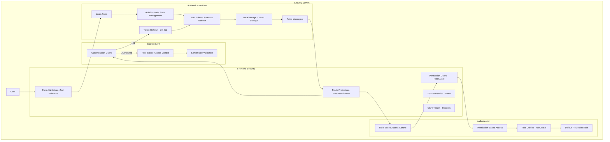

### Role-Based Access Control (RBAC)

The system implements comprehensive role-based access control with 4 distinct user roles:

| Role             | Dashboard Route            | Key Permissions                                    |
| ---------------- | -------------------------- | -------------------------------------------------- |
| **Admin**        | `/admin/dashboard`         | Full system access, user management, reports      |
| **Doctor**       | `/doctor/dashboard`        | Patient management, appointments, prescriptions   |
| **Lab Technician** | `/lab/dashboard`         | Sample management, test results                     |
| **Receptionist** | `/receptionist/dashboard` | Patient registration, appointment scheduling       |

**Features:**
- ✅ `RoleBasedRoute` component for route-level protection
- ✅ `RoleGuard` component for permission-based access
- ✅ Automatic redirect to role-appropriate dashboard
- ✅ Permission-based navigation menu filtering
- ✅ Route permission checking via `hasRoutePermission()`

## 🎯 Key Features by Layer

### Application Layer (apps/web)

| Feature                | Technology            | Status             |
| ---------------------- | --------------------- | ------------------ |
| **40+ Routes**         | React 19 + TypeScript | ✅ Implemented     |
| **File-based Routing** | TanStack Router       | ✅ Configured      |
| **Server State**       | TanStack Query        | ✅ Implemented     |
| **Form Management**    | React Hook Form + Zod | ✅ Implemented     |
| **Authentication**     | JWT + Token Refresh   | ✅ Implemented     |
| **Role-Based Access**  | RBAC with Guards      | ✅ Implemented     |
| **Theme System**       | Dark/Light Mode       | ✅ Implemented     |
| **Responsive Design**  | Mobile-first          | ✅ Implemented     |
| **Export Features**    | PDF/Excel (jsPDF, xlsx) | ✅ Implemented    |
| **4 User Roles**       | Admin, Doctor, Lab, Receptionist | ✅ Implemented |

### UI Package (packages/ui)

| Category             | Components                            | Count   |
| -------------------- | ------------------------------------- | ------- |
| **Forms**            | Button, Input, Select, Checkbox, etc. | 15+     |
| **Data Display**     | DataTable, Card, Badge, Calendar      | 10+     |
| **Layout**           | Dialog, Sidebar, Menu, Tabs           | 12+     |
| **Feedback**         | Toast, Progress, Spinner, Skeleton    | 8+      |
| **Utilities**        | Provider, Hooks, Utils                | 5+      |
| **Total Components** | -                                     | **50+** |

### API SDK Package (packages/lib)

| API Module                | Description                      | Status              |
| ------------------------- | -------------------------------- | ------------------- |
| **Authentication**        | Login, Register, Token Refresh  | ✅ Implemented       |
| **User Management**       | User CRUD Operations             | ✅ Implemented       |
| **Patient Management**    | Patient CRUD & List Operations   | ✅ Implemented       |
| **Doctor Operations**     | Doctor-specific APIs & Statistics| ✅ Implemented       |
| **Relationships**         | Patient Relationships            | ✅ Implemented       |
| **Services**              | Service Management               | ✅ Implemented       |
| **Service Categories**    | Category Management              | ✅ Implemented       |
| **Service Requests**      | Service Request Management       | ✅ Implemented       |
| **Service Request Details**| Request Detail Management        | ✅ Implemented       |
| **Appointments**          | Appointment Scheduling           | ✅ Implemented       |
| **Samples**               | Sample Management                | ✅ Implemented       |
| **Example**               | Example/Template API              | ✅ Implemented       |
| **Total API Modules**     | **13 modules**                   | ✅ Connected to API  |

## 🚀 Development Workflow

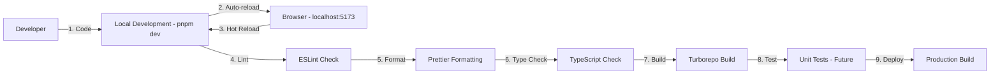

## 📊 Performance Optimization

### Code Splitting Strategy

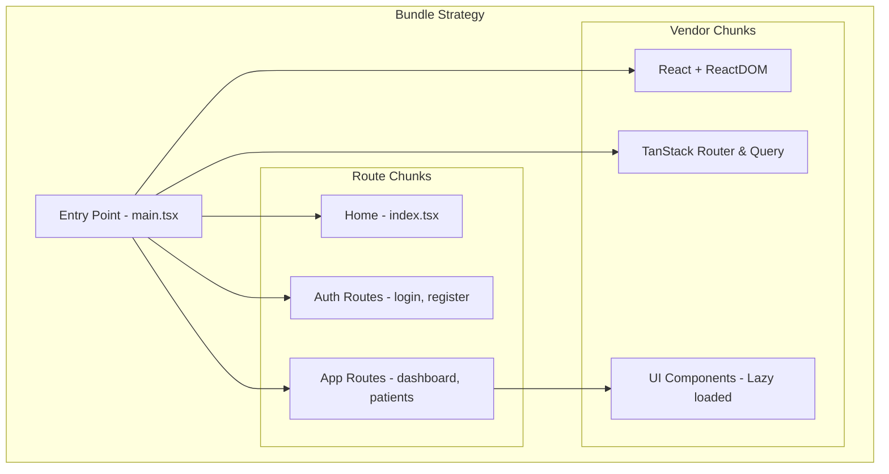

### Optimization Techniques

1. **Code Splitting**: Route-based automatic splitting
2. **Lazy Loading**: Components loaded on demand
3. **Tree Shaking**: Unused code elimination
4. **Caching**: TanStack Query caching strategy
5. **Memoization**: React.memo for expensive components
6. **Virtual Scrolling**: For large lists (DataTable)

## 🔄 State Management Strategy

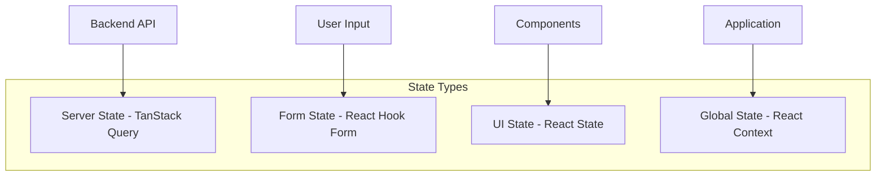

## 🎨 Design System

### Theme Configuration

```javascript
// Tailwind Design Tokens
{
  colors: {
    primary: "hsl(var(--primary))",
    secondary: "hsl(var(--secondary))",
    accent: "hsl(var(--accent))",
    // ... more colors
  },
  spacing: "4px base scale",
  typography: "Inter font family",
  borderRadius: "0.5rem default",
  animations: "Tailwind + React Aria"
}
```

### Component Variants

- **Button**: 10+ variants (primary, secondary, outline, ghost, etc.)
- **Badge**: Status colors (green, blue, orange, red, gray)
- **Card**: Elevated, outlined, interactive
- **Form Fields**: Default, error, disabled states

## 📱 Responsive Design

### Breakpoints

| Breakpoint  | Size           | Layout                   |
| ----------- | -------------- | ------------------------ |
| **Mobile**  | < 768px        | 1 column, hamburger menu |
| **Tablet**  | 768px - 1024px | 2 columns, drawer menu   |
| **Desktop** | > 1024px       | 3-4 columns, sidebar     |
| **Wide**    | > 1440px       | Full features, max-width |

## 🧪 Testing Strategy (Future)

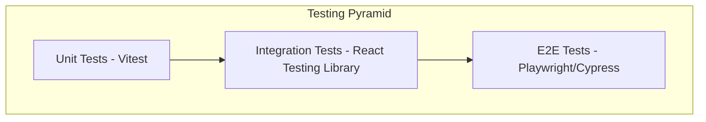

## 📦 Deployment Architecture

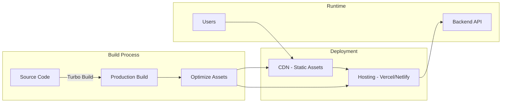

## 🎯 Next Steps for Production

### Phase 1: Backend Integration ✅

- [x] Connect API endpoints (13 modules implemented)
- [x] Implement authentication flow (JWT + Refresh)
- [x] Implement role-based access control
- [x] Test CRUD operations
- [x] Handle error cases (401, token refresh)
- [x] Export utilities (PDF/Excel)

### Phase 2: Enhanced Features ✅

- [x] Calendar component (appointments - DatePicker/Calendar)
- [x] Export features (PDF/Excel via jsPDF, xlsx)
- [x] File upload components (Dropzone, Uploader)
- [x] Multi-role dashboard layouts
- [x] Form modals for quick actions
- [ ] Charts library integration (dashboard analytics)
- [ ] Real-time notifications

### Phase 3: Testing & QA

- [ ] Unit tests for utilities
- [ ] Integration tests for pages
- [ ] E2E tests for user flows
- [ ] Accessibility audit

### Phase 4: Performance

- [ ] Lighthouse optimization
- [ ] Bundle size optimization
- [ ] Image optimization
- [ ] Caching strategy

### Phase 5: Production Ready

- [ ] Environment configuration
- [ ] CI/CD pipeline
- [ ] Monitoring & logging
- [ ] Documentation

## 📚 Documentation Links

- **Main README**: `/README.md`
- **Project Summary**: `/PROJECT_SUMMARY.md`
- **Implementation Summary**: `/IMPLEMENTATION_SUMMARY.md`
- **Web App Docs**: `/apps/web/README_CRYOBANK.md`
- **Usage Examples**: `/apps/web/USAGE_EXAMPLES.md`

## 🏆 Architecture Highlights

### ✅ Strengths

1. **Monorepo Structure**: Organized code sharing with Turborepo
2. **Type Safety**: Full TypeScript coverage
3. **Accessibility**: React Aria Components for WCAG compliance
4. **Scalability**: Modular architecture with clear separation
5. **Developer Experience**: Fast builds, hot reload, type checking
6. **Production Ready**: Professional code quality and structure
7. **Maintainability**: Clear patterns and comprehensive documentation
8. **Performance**: Optimized build with code splitting

### 🎯 Best Practices Implemented

- ✅ File-based routing for predictable structure
- ✅ Shared UI library for consistency
- ✅ API SDK for type-safe backend communication
- ✅ Form validation with Zod schemas
- ✅ Error boundaries and loading states
- ✅ Responsive mobile-first design
- ✅ Dark mode support
- ✅ Comprehensive TypeScript types

---

### 📊 Current Statistics

- **Total Routes**: 40+ (Public + Role-based)
- **API Modules**: 13 (Fully implemented & connected)
- **UI Components**: 50+ (Shared component library)
- **User Roles**: 4 (Admin, Doctor, Lab Technician, Receptionist)
- **Protected Routes**: 30+ (Role-based access control)
- **Export Formats**: PDF, Excel (jsPDF, xlsx)

---

**Version**: 2.0  
**Last Updated**: January 2025  
**Project**: Fertility Service & Cryobank Management System  
**Stack**: React 19 + TypeScript + Vite + TanStack Router + TanStack Query + React Aria Components  
**Backend API**: Connected to `https://cryofert.runasp.net/api`
